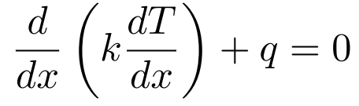
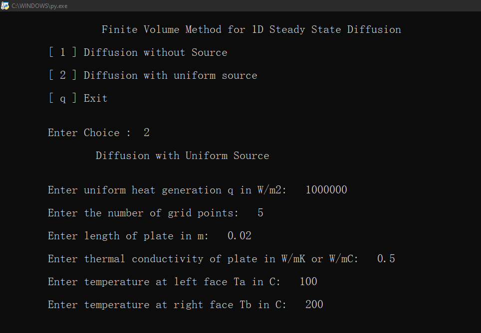
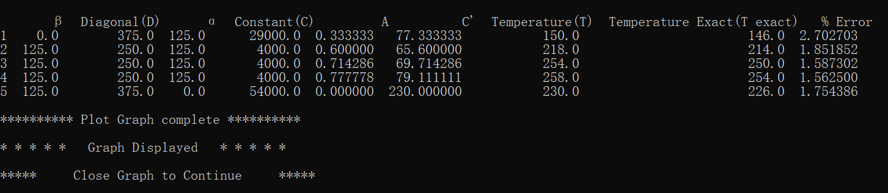
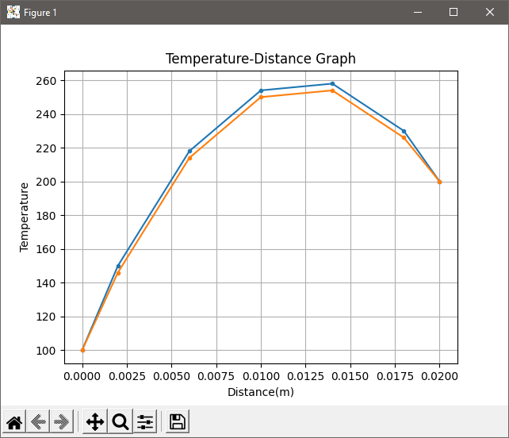
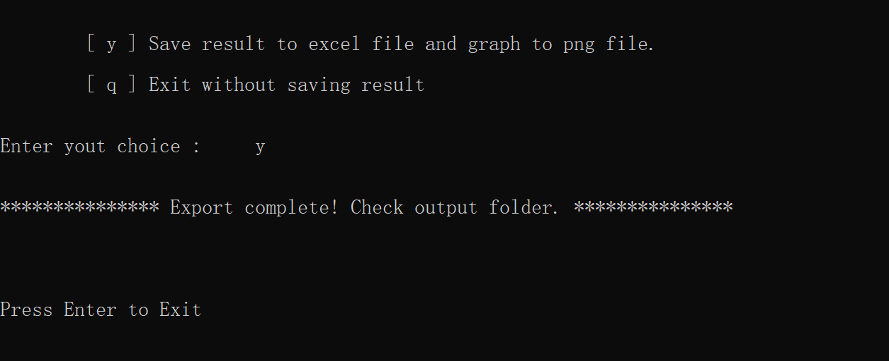

# FVM-1D-Steady State Diffusion solver
## Python code for Finite Volume Method for 1 Dimension Steady Stade Diffusion

Read _[FVM-1D.pdf](FVM-1D.pdf)_ in the repository to understand the finite volume method for 1D steady state diffusion.
The _governing equation_ used in the python code is

The python code has all the necessary comments to understand the solver.

_**Note** : In this solver cross sectional area is not required as we deal in one dimension only, so we measure heat diffusion across the length only._

## Motivation
To learn Python programming and use python packages.

## Dependencies
- [Python](https://python.org) 3.9.5

- [Pandas](https://pandas.pydata.org) 1.2.4

- [Openpyxl](https://openpyxl.readthedocs.io) 3.0.7

- [Matplotlib](https://matplotlib.org) 3.4.2

## Output
User input data :

Solution which is printed in tabular form :

New window of graph is showed (close graph to continue) :

Export result to output folder :

_**Note** : Previous saved result will be overwritten so copy the previous result to some other folder._

## License

[Apache License 2.0](LICENSE)

## Author

[Yahya Ansari](https://github.com/novus-afk)
